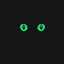

<h1 align="center">
   
  
   
  Enigma for <a href="https://code.visualstudio.com/">Visual Studio Code</a>
   
</h1>

  <strong>Embrace the power of the unknown with "Enigma" and watch as your creations come to life!</strong>

  

## Creator

|  |
| ---------------------------------------------------------------------------------------------------- |
| [Otávio Carmo](https://github.com/otaviosc)|

## License

[MIT License](./LICENSE.md)